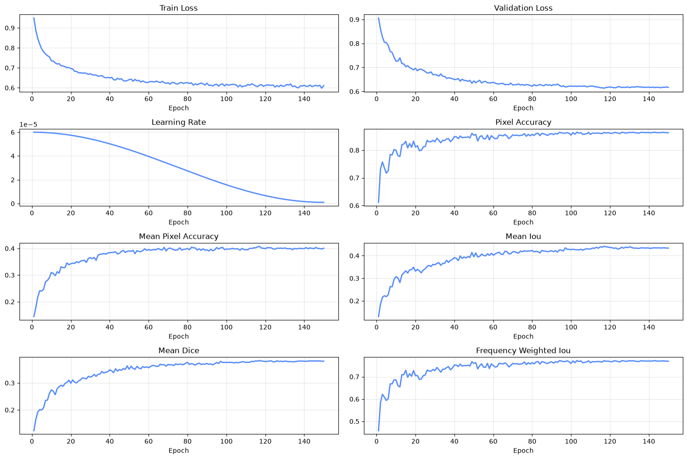
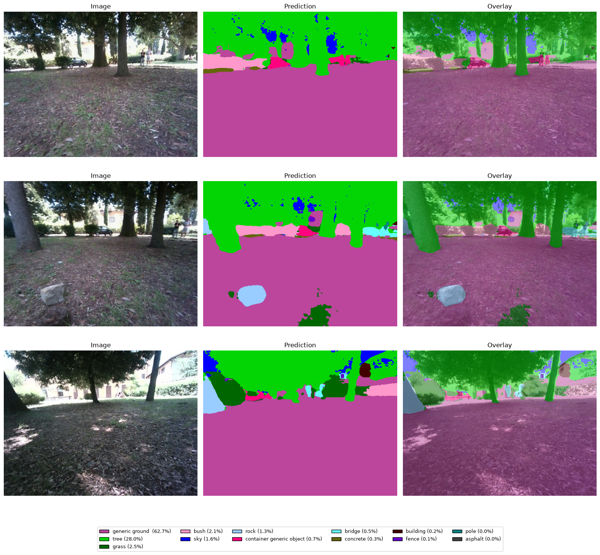

# SegFormer-B1 Forest Semantic Segmentation — Fine-Tuning

Fine-tuning of **SegFormer-B1** (NVIDIA / Hugging Face) for pixel-wise semantic segmentation of forest scenes from RGB images. This is the perception component of **Forest Semantic Navigation**, a project enabling a **Boston Dynamics Spot** robot to build a semantic 2.5D traversability map and 3D semantic point cloud while navigating real forest terrain — specifically the **Vallombrosa forest near Florence, Italy** — with inference running on Spot's onboard **Jetson** platform.

This repository covers **only the segmentation training and evaluation stage**: dataset preparation, loss-function ablation, training, and qualitative/quantitative evaluation. The mapping pipeline (2.5D elevation map, 3D semantic point cloud, semantic cost fusion) and the ONNX/TensorRT deployment stage live in the main `Forest_Semantic_Navigation` repository.

## Dataset

[ForestSim](https://arxiv.org/abs/2603.27923) — a synthetic benchmark for intelligent-vehicle perception in unstructured forest environments — with **24 semantic classes**.

Not every class is relevant to the downstream mapping/navigation task; the classes that actually drive traversability estimation are `tree`, `rock`, `water` (streams), `grass` / `tall grass`, `generic ground`, and `sky`. The remaining classes are kept during training for completeness of the segmentation head but play a minor role downstream.

<!-- TODO: se vuoi, aggiungi qui una tabella con il numero di immagini train/val/test, come nella tabella "Dataset" dell'esempio ChessQ -->

## Experimental Setup

Training was run on the same machine used for the ChessQ CV pipeline:

| Component | Detail |
|---|---|
| GPU | NVIDIA GeForce RTX 5090 (32 GB) |
| CPU | AMD Ryzen 9 9900X (12-core) |
| OS | Linux (Ubuntu-based) |
| Python | 3.12.3 |
| PyTorch | 2.13.0 (CUDA 13.0) |

## Training Configuration

| Parameter | Value |
|---|---|
| Base weights | SegFormer-B1 (`nvidia/segformer-b1-finetuned-ade-512-512`, pretrained) |
| Image size | `512x512` |
| Num. classes | 24 (`ignore_index = 255`) |
| Epochs | 150 |
| Batch size | 16 |
| Validation split | 10% |
| Loss function | Tversky (α = 0.3, β = 0.7) |
| Optimizer | AdamW (β = [0.9, 0.999], eps = 1e-8) |
| Learning rate | 6e-5, weight decay 0.01 |
| LR schedule | Cosine annealing (η_min = 1e-6), 5-epoch warmup |
| Gradient clipping | 1.0 |
| Mixed precision | enabled |
| Early stopping | disabled |
| Seed | 42 |

## Loss Function Ablation

Four loss configurations were compared while keeping the rest of the pipeline fixed: **Dice+CE**, **Focal**, **Tversky**, and **Dice** alone. Quantitatively the four configurations land in a similar range — Dice+CE, the strongest by raw numbers, reached mIoU ≈ 0.441 / FWIoU ≈ 0.792 — so none of them stood out as a clear numerical winner.

The deciding factor ended up being qualitative. Forest scenes have a chronic, hard-to-fix problem: the `rock` class tends to get absorbed into `generic ground` or confused with `tree` in shadowed areas. Standard Dice+CE handles the easy, dominant classes well but is comparatively weak exactly there. **Tversky loss (α = 0.3, β = 0.7)**, combined with a stronger augmentation policy and batch size 16, visibly improved rock boundary detection in qualitative inspection, at the cost of a slightly increased `bush` → `grass` confusion under the more aggressive color/shadow augmentation.

The Tversky loss generalizes the Dice loss by weighting false positives and false negatives independently, via the Tversky index:

$$
TI = \frac{TP}{TP + \alpha \cdot FP + \beta \cdot FN}, \qquad \mathcal{L}_{Tversky} = 1 - TI
$$

where $TP$, $FP$, $FN$ are the (soft) true-positive, false-positive and false-negative counts for a class, and $\alpha + \beta = 1$. With $\alpha = 0.3$ and $\beta = 0.7$, false negatives are penalized more heavily than false positives — i.e. the loss is pushed to favor **recall** over precision, which is exactly what a rare, easily-missed class like `rock` needs: it's better for the model to over-predict rock and get corrected than to miss it and silently merge it into `generic ground`.

Given that the numeric gap between configurations was small and rock detection matters most for safe traversability estimation, **the Tversky-trained checkpoint was selected as the final model**.



Training/validation loss and pixel-level metrics (pixel accuracy, mean pixel accuracy, mean IoU, mean Dice, frequency-weighted IoU) over 150 epochs, with a cosine-annealed learning rate peaking around 6e-5. Both losses drop steadily and flatten after ~epoch 60; pixel metrics plateau in the same region, with mean IoU settling around 0.43 and frequency-weighted IoU around 0.78. FWIoU sits well above mean IoU because the segmentation is dominated by a few large, easy classes (ground, tree, sky), while mean IoU is pulled down by rare/hard classes such as `rock`.
### Qualitative Results

Predictions on real photographs taken in the Vallombrosa forest — a genuine sim-to-real test, since the model is trained purely on synthetic ForestSim data and had never seen these scenes:



The model generalizes reasonably well to the real domain: `generic ground`, `tree`, `sky` and `bush` are segmented cleanly across all three scenes despite the strong dappled shadow typical of a forest canopy, and in the second row the foreground `rock` is correctly picked out — the exact class the ablation above was aimed at. Failure modes are still visible: thin canopy structures (branches against sky) get somewhat noisy boundaries, and small background objects far from the camera (people, a bench, a parked car) are labeled with low-frequency classes (`container generic object`, `bridge`, `building`) that aren't reliable at that distance and aren't relevant to the navigation task anyway.


## Repository Structure

```text
.
├── assets/                         # Plots and qualitative evaluation samples
│   ├── plots.png
│   └── qualitative.png
│
├── configurations/                # YAML configuration files
│   ├── dataset_configuration.yaml
│   ├── model_configuration.yaml
│   └── training_configuration.yaml
│
├── dataset/                       # Dataset loading, preprocessing and analysis
│   ├── dataloader.py
│   ├── dataset_config_loader.py
│   ├── dataset_distribution.py
│   ├── dataset_info.py
│   ├── dataset_visualization.py
│   ├── download_dataset.py
│   ├── forest_dataset.py
│   └── transforms.py
│
├── models/                        # Model architectures and configuration
│   ├── model_config_loader.py
│   └── segformer.py
│
├── training/                      # Training pipeline and utilities
│   ├── checkpoint.py
│   ├── early_stopping.py
│   ├── logger.py
│   ├── losses.py
│   ├── metrics.py
│   ├── optimizer.py
│   ├── scheduler.py
│   ├── train.py
│   ├── trainer.py
│   └── training_config_loader.py
│
├── evaluation/                    # Evaluation, benchmarking and visualization
│   ├── benchmark.py
│   ├── plots.py
│   ├── qualitative_evaluation.py
│   ├── quantitative_evaluation.py
│   └── training_plots.py
│
├── deployment/                    # Model export and deployment utilities
│   └── export_model.py
│
├── notebooks/                     # Exploratory analysis and experiments
│   ├── dataset_analysis.ipynb
│   ├── semantic_segmentation_benchmark.ipynb
│   └── vis_forestsim_spot_evaluation.ipynb
│
└── README.md
```

### Project Organization

The repository is organized as a modular semantic segmentation pipeline:

* **`configurations/`** contains the YAML files defining dataset, model, and training settings.
* **`dataset/`** handles dataset acquisition, loading, preprocessing, augmentation, class mapping, statistics, and visualization.
* **`models/`** contains the model implementation, currently based on **SegFormer**, together with its configuration loader.
* **`training/`** provides the complete training pipeline, including losses, metrics, optimizers, schedulers, checkpointing, logging, and early stopping.
* **`evaluation/`** contains quantitative and qualitative evaluation utilities, training plots, confusion matrices, and inference-performance benchmarking.
* **`deployment/`** provides utilities for exporting the trained model to **ONNX**, optionally building a **TensorRT** engine, and benchmarking inference performance.
* **`notebooks/`** contains notebooks for dataset analysis, model benchmarking, and qualitative evaluation on real-world ForestSim/Spot data.
* **`assets/`** stores plots and qualitative results used throughout this README.

### Pipeline Overview

The overall workflow can be summarized as:

```text
YAML Configurations
        │
        ▼
Dataset Download & Preprocessing
        │
        ▼
PyTorch DataLoaders
        │
        ▼
SegFormer Model
        │
        ▼
Training
        │
        ├── Loss
        ├── Metrics
        ├── Checkpoints
        ├── Logging
        └── Early Stopping
        │
        ▼
Evaluation & Benchmarking
        │
        ├── Quantitative Evaluation
        ├── Qualitative Evaluation
        └── Inference Benchmark
        │
        ▼
Deployment
        │
        └── ONNX / TensorRT
```
    

## Deployment Target

The selected checkpoint is exported to ONNX (and subsequently TensorRT FP16 on Spot's Jetson) as the perception front-end of the mapping pipeline: RGB predictions are fused with depth to build the 2.5D traversability map and 3D semantic point cloud used for field navigation in Vallombrosa. That stage lives in the main `Forest_Semantic_Navigation` repository.

## Limitations

- **Synthetic-to-real domain gap**: the model is trained entirely on ForestSim synthetic data. The qualitative results above are an encouraging first sign, but this hasn't been validated quantitatively — there is no pixel-level ground truth for the real Vallombrosa frames.
- **Augmentation trade-off**: the stronger augmentation policy used for this run improves rock segmentation but increases confusion between visually similar green classes (`bush` vs `grass`); this hasn't been fully tuned yet.


## References

E. Xie, W. Wang, Z. Yu, A. Anandkumar, J. M. Alvarez, P. Luo, *SegFormer: Simple and Efficient Design for Semantic Segmentation with Transformers*, arXiv:2105.15203, 2021. [Paper](https://arxiv.org/abs/2105.15203)

```bibtex
@misc{xie2021segformersimpleefficientdesign,
      title={SegFormer: Simple and Efficient Design for Semantic Segmentation with Transformers}, 
      author={Enze Xie and Wenhai Wang and Zhiding Yu and Anima Anandkumar and Jose M. Alvarez and Ping Luo},
      year={2021},
      eprint={2105.15203},
      archivePrefix={arXiv},
      primaryClass={cs.CV},
      url={https://arxiv.org/abs/2105.15203}, 
}
```

P. Wagle, Z. Chen, L. Liu, *ForestSim: A Synthetic Benchmark for Intelligent Vehicle Perception in Unstructured Forest Environments*, arXiv:2603.27923, 2026. [Paper](https://arxiv.org/abs/2603.27923)

```bibtex
@misc{wagle2026forestsimsyntheticbenchmarkintelligent,
      title={ForestSim: A Synthetic Benchmark for Intelligent Vehicle Perception in Unstructured Forest Environments}, 
      author={Pragat Wagle and Zheng Chen and Lantao Liu},
      year={2026},
      eprint={2603.27923},
      archivePrefix={arXiv},
      primaryClass={cs.CV},
      url={https://arxiv.org/abs/2603.27923}, 
}
```